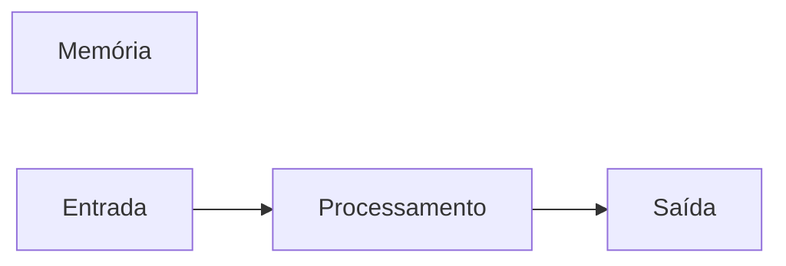

# JavaScript
Repositório usado para estudo de lógica de programação com uso da linguagem Java Script.
## AUTOR 
Stela Calmon

---
## Variáveis
Variáveis são espaços na memória do computador usados para guardar valores que podem alterar ao longo do programa.
###Principais tipos primitivos 
- strings (texto)
- number (números inteiros e não inteiros)
- boolean (verdadeiro ou falso)

## Operadores Aritméticos 
| Operador | Propósito | Exemplo | Resultado | 
| ---------|-----------|---------|-----------|
| = | Atribuir um valor | x = 10 | x = 10|
| + | Somar | 10 + 5 | 15 |
| += | somar e atribuir | x += 5 | x = 15 |
